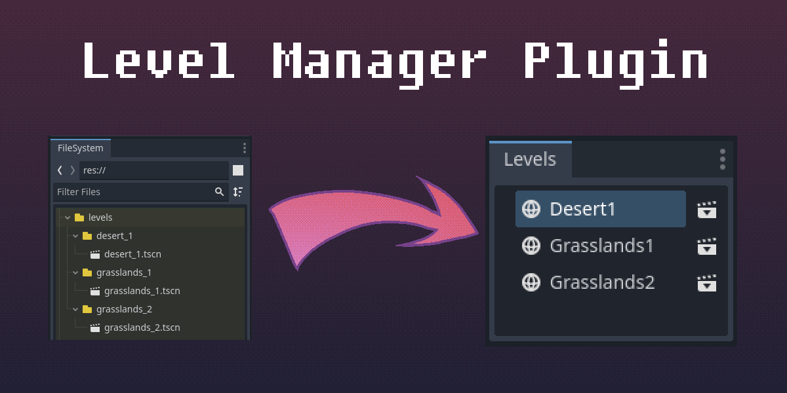

Scenario: You are making a game which is logically divided into "levels".
The levels are defined by their location in the filesystem,
but navigating the filesystem is annoying and cluttered.

Let's build a plugin to make level management easier!

::: note
We're going to jump straight into an existing project here.

If you'd like to follow along, and don't have a project of your own,
you can download the sample project here:

[{{ comp.icon({ icon: "file-zip" }) }} Starter Project](https://github.com/apples/level-manager-demo/archive/refs/tags/initial.zip){.button}
:::

## The Project So Far

First of all, let's look at the game itself:

{{ comp.video({ src: "initial_gameplay.webm" }) }}

:sparkles: Cute! :sparkles:

We have a sequence of 3 levels, and when the player reaches the edge of the screen,
a transition animation is played which loads the next level and scrolls the screen.

Here is what our filesystem looks like:

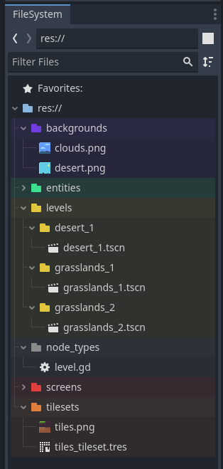{.img-float-left}

The most important part of this filesystem is the `res://levels` directory.
This directory contains several subdirectories, each one representing a level.
And within each level's directory, there is a scene file with the same name.

As you can see, we have 3 levels so far:

- `desert_1`
- `grasslands_1`
- `grasslands_2`

Also relevant are `res://backgrounds` which contains the level background images,
`res://node_types/level.gd` which is the base script that all level scenes use,
and `res://tilesets/tiles_tileset.tres` which every level uses in its tilemap.

<div class="clear-both"></div>

And finally, here's an example level scene:

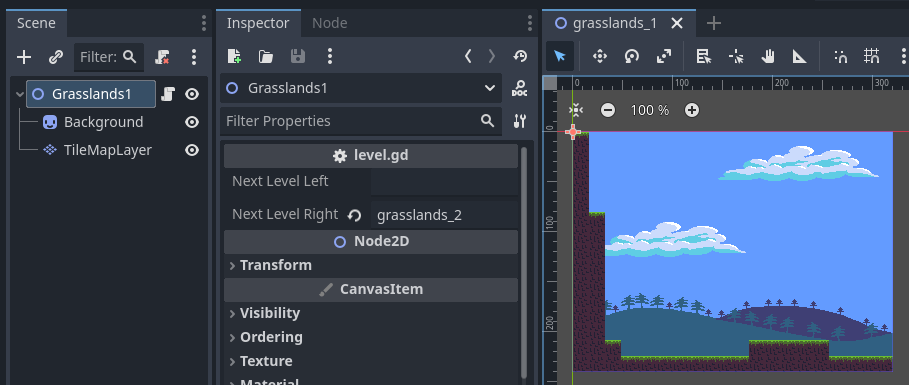

A key thing to notice here is that each scene uses the `level.gd` script,
and uses the `next_level_left` and `next_level_right` fields to affect screen transitions.

## The Problem

Managing levels in this system is annoying!

First of all, using the Filesystem tab to view the levels is frustrating,
because of all the other top-level directories that get in the way,
and the need to constantly fiddle with the folding structure.

Adding new levels is also a huge pain, because every level must conform to a certain structure.
Duplicating level scenes is possible right now, but as soon as the scenes start requiring external resources
(e.g. navigation), it quickly becomes a very error-prone and fiddly process.

Here's a complete checklist of steps to perform when adding a new level:

- Create the subdirectory in `res://levels`.
- Create the scene file.
- Set the scene's root node's script to `res://node_types/level.gd`.
- Add a `Sprite2D` node.
- Set the sprite's position and texture to an appropriate background.
- Add a `TileMapLayer` node.
- Set the tilemap layer's `tile_set` to `res://tilesets/tiles_tileset.tres`.

That's already an annoying amount of boilerplate, and this game is as simple as it gets!

But wait, there's more!

Did you notice anything about the `next_level_left` and `next_level_right` fields?
That's right, they're strings! *\[screaming]*

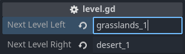

Editing these fields is incredibly error-prone.
A simple typo will result in a runtime error, which might not be caught for a while.
Also, it's just annoying to need to type the level names.
You might even resort to copy-pasting! What a blunder *that* would be, right?

## The Solution

If the interface is frustrating, make a new interface.

If the process is tedious, automate it.

Sounds like we need a plugin!

Let's make a list of features we want in our plugin:

- The plugin must maintain a list of all the levels.
- A new dockable tab panel that shows the levels in a convenient list.
- A button to create a new level with all the boilerplate already set up.
- Convert the `next_level_` fields from simple strings into a safe enum list.

We could go even further, such as displaying a visual map of the levels,
but if you want something that complex,
 I'd recommend looking into something like KoBeWi's [Metroidvania System](https://github.com/KoBeWi/Metroidvania-System).

## Step 0 - Creating the Plugin

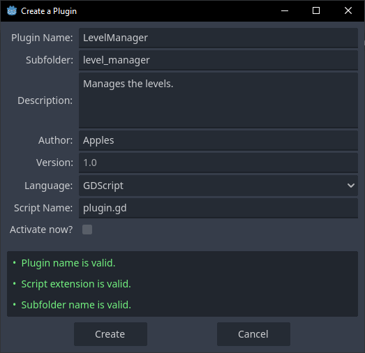

If you're not already familiar with how to create a plugin, the process is pretty easy.
Simply go to `Project -> Project Settings -> Plugins` and click `Create New Plugin`.
Fill out the details however you wish, and click `Create`.

## Step 1 - Gathering the Levels

Let's start by making the plugin script collect and maintain a list of all the levels.

The resource filesystem's {{ comp.gddoc({ gd: "signal EditorFilesystem.filesystem_changed" }) }} signal can be used to automatically refresh the levels list,
but keep in mind this will trigger for *any* file changes, even if the user simply hits `Ctrl+S`.
Alternatively, you could add a button somewhere to manually refresh the list.

For debugging, let's just print out the result.

```gdscript:/addons/level_manager/plugin.gd
@tool
extends EditorPlugin

signal levels_refreshed()

const LEVELS_DIR = "res://levels"

## Maps level ids to level data, where level data is { id, dir, scene_file }.
var levels: Dictionary

func _enter_tree() -> void:
	refresh_levels()
	get_editor_interface().get_resource_filesystem().filesystem_changed.connect(refresh_levels)

	print("levels = ", levels)

func _exit_tree() -> void:
	pass

func refresh_levels() -> void:
	levels = {}
	
	for level_id in DirAccess.get_directories_at(LEVELS_DIR):
		var level_dir := LEVELS_DIR.path_join(level_id)
		var level_scene_file := level_dir.path_join(level_id + ".tscn")
		
		if not ResourceLoader.exists(level_scene_file):
			push_warning("Level %s is missing its scene file!" % [level_dir])
			continue
		
		levels[level_id] = { id = level_id, dir = level_dir, scene_file = level_scene_file }
	
	levels_refreshed.emit()
```

Now, if we go to `Project -> Project Settings -> Plugins` and restart our plugin,
we should see the following output in the console:

```
levels = { "desert_1": { "id": "desert_1", "dir": "res://levels/desert_1", "scene_file": "res://levels/desert_1/desert_1.tscn" }, "grasslands_1": { "id": "grasslands_1", "dir": "res://levels/grasslands_1", "scene_file": "res://levels/grasslands_1/grasslands_1.tscn" }, "grasslands_2": { "id": "grasslands_2", "dir": "res://levels/grasslands_2", "scene_file": "res://levels/grasslands_2/grasslands_2.tscn" } }
```

Neat!

## Step 2 - Levels Dock

The first of our requirements is that we need a simple "Levels" dock,
which will display a list of our levels and allow us to open them.

Before we can proceed, we need to create the scene for our dock control.

Let's create a scene called `levels_dock.tscn` in the plugin's directory,
and make the root a `MarginContainer`. We'll go ahead and attach a script to it as well.

The root node's name will be used as the label for the dock tab.

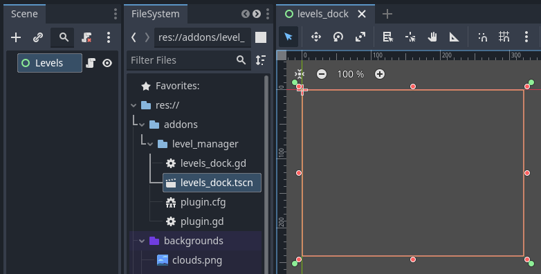

Go ahead and attach a script to it as well:

```gdscript:/addons/level_manager/levels_dock.gd
@tool
extends MarginContainer

const Plugin = preload("res://addons/level_manager/plugin.gd")

var plugin: Plugin

func _ready() -> void:
	pass
```

Make sure it's a `@tool` script, or nothing will work.

The `plugin` variable will hold a reference to our plugin instance,
so that the dock script will have access to the `levels` data.

Okay, now we can go back to `plugin.gd` and have it add our new dock tab!

```gdscript:/addons/level_manager/plugin.gd {data-start=11 data-highlight="18-20 23"}
const LEVELS_DOCK = preload("res://addons/level_manager/levels_dock.tscn")

var levels_dock: Node

func _enter_tree() -> void:
	refresh_levels()
	
	levels_dock = LEVELS_DOCK.instantiate()
	levels_dock.plugin = self
	add_control_to_dock(EditorPlugin.DOCK_SLOT_LEFT_BR, levels_dock)

func _exit_tree() -> void:
	levels_dock.queue_free()
```

Restart the plugin, and...

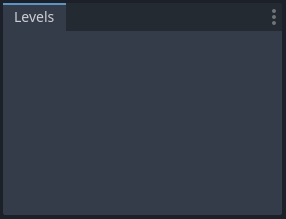

Boom! Levels!

It's kinda... empty, though. Let's fix that!

First we'll add a `Tree` control to the dock scene.
Enable the {{ comp.gddoc({ gd: "property Tree.hide_root" }) }} property, because we want our levels to act as top-level items.

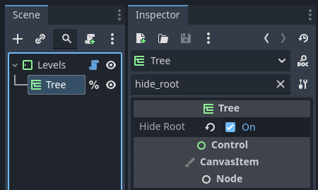

Now we simply need to iterate over the level list from the plugin,
and update the tree items to match.

```gdscript:/addons/level_manager/levels_dock.gd {data-highlight="21-22"}
@tool
extends MarginContainer

enum {
	BUTTON_EDIT_SCENE = 1,
}

const Plugin = preload("res://addons/level_manager/plugin.gd")

var plugin: Plugin

var root_item: TreeItem

@onready var tree: Tree = %Tree

func _ready() -> void:
	if EditorInterface.get_edited_scene_root() == self:
		return
	
	root_item = tree.create_item()
	refresh()
	plugin.levels_refreshed.connect(refresh)

func refresh() -> void:
	var levels := plugin.levels.values()
	
	for i in levels.size():
		var level_item: TreeItem
		
		if root_item.get_child_count() <= i:
			level_item = root_item.create_child()
			level_item.set_icon(0, get_theme_icon("Environment", "EditorIcons"))
			level_item.add_button(0, get_theme_icon("InstanceOptions", "EditorIcons"),
				BUTTON_EDIT_SCENE, false, "Edit Scene")
		else:
			level_item = root_item.get_child(i)
		
		level_item.set_metadata(0, levels[i].id)
		level_item.set_text(0, levels[i].id.to_pascal_case())
	
	for i in range(root_item.get_child_count() - 1, levels.size() - 1, -1):
		root_item.get_child(i).free()
```

Note that we also need to connect to the `plugin.levels_refreshed` signal.

The `refresh()` function is pretty straightforward.
Simply iterate over the levels, and update the corresponding tree item at the same index.

If the iteration runs past the number of tree items, create new items on the fly.

Afterwards, free any unused tree items.

::: section
### Explaining Trees

Alright, so, {{ comp.gddoc({ gd: "class Tree" }) }} and {{ comp.gddoc({ gd: "class TreeItem" }) }} can seem pretty intimidating when looking at the docs.
But really, they're not so bad!

The first thing to know is that the tree always needs to have a root item.
That's why we need to create the `root_item` in the `_ready()` function,
and then hold onto it forever.

Then, for each level, we can create a new child item under the root.

Each `TreeItem` is essentially an array of cells.
In this case, each item only has one cell, because the tree's `columns` property is `1`.

Each cell can have a text label, an icon, and any number of buttons (each button being an icon).
Also, hidden metadata can be assigned to the cell.

So here's what each of our item cells has:
- An icon (I chose to use the editor's `"Environment"` icon, but you can make your own).
- A text string, in this case it's the level's `id` converted to `PascalCase` for readability.
- A single button, which currently does nothing.
- Metadata which is the level's `id`, for identifying cells and buttons clicked.
:::

Finally, with all that out of the way, let's restart the plugin and see how we're doing:

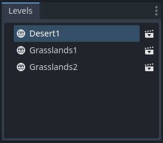

Wow that looks so much better!

The only thing left to do is make the button work.

Simply connect the tree's `button_clicked` signal to the dock script...

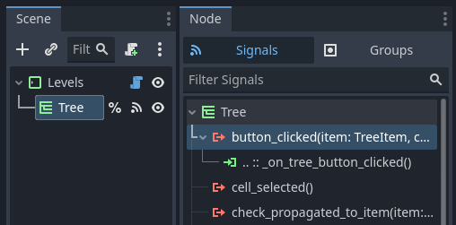

And then use {{ comp.gddoc({ gd: "method EditorInterface.open_scene_from_path" }) }} to open the selected scene.
Recall that we're storing the level's id in the tree item's cell metadata.

```gdscript:/addons/level_manager/levels_dock.gd {data-start=45}
func _on_tree_button_clicked(item: TreeItem, column: int, id: int, mouse_button_index: int) -> void:
	if mouse_button_index != MOUSE_BUTTON_LEFT:
		return
	
	match id:
		BUTTON_EDIT_SCENE:
			var level_id = item.get_metadata(column)
			var level = plugin.levels[level_id]
			EditorInterface.open_scene_from_path(level.scene_file)
```

Easy.

Restart the plugin and verify that the buttons do, in fact, work!

{{ comp.video({ src: "level_dock_buttons.webm" }) }}

And with that, we've accomplished half of our goals! :tada:

## Step 3 - Automated Level Creation

::: note
I'm going to stop showing every new line of code,
and instead focus on the important parts.

I'll mostly be skipping over things like `@onready` var declarations,
and other things that should feel routine/obvious.

If you happen to lose track of things, please check out the completed sample project
linked at the bottom of this article.
:::

Now that we have this fancy Levels dock, we can pretty much add whatever we want to it.

Let's add that button which will create a level for us.

We'll need to wrap the existing `Tree` node in a new `VBoxContainer`,
and then add a new `HBoxContainer` which will contain the new `Button`.

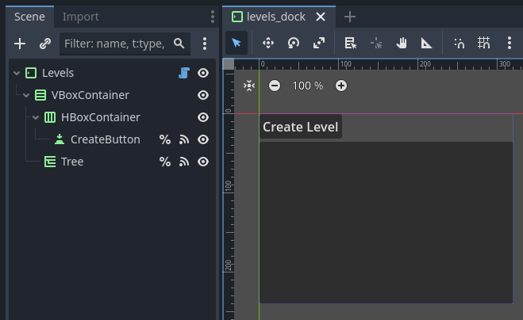

We'll also need to create a dialog for the user to provide details on how to make the level.

For now, we can just shove the dialog into the dock scene,
but it might be worth pulling into its own scene eventually.

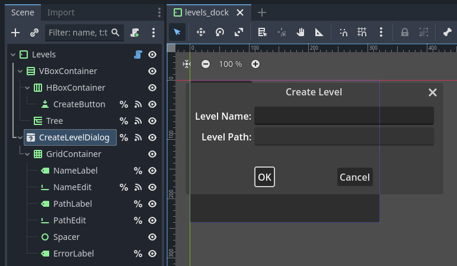

This dialog can pretty much be set up however you want.

Here's the code I use to initialize some editor-friendly stylings:

```gdscript:/addons/level_manager/levels_dock.gd {data-start=32}
	create_button.icon = get_theme_icon("Add", "EditorIcons")
	error_label.add_theme_color_override("font_color", get_theme_color("error_color", "Editor"))
```

::: note
Make sure to save the scene with the dialog hidden,
otherwise it will pop up when the plugin is enabled.
:::

We've got a lot of signals to connect here, so lets just sprint through them!

```gdscript:/addons/level_manager/levels_dock.gd {data-start=65}
func _on_create_button_pressed() -> void:
	create_level_dialog.popup_centered()
	_update_create_level_dialog()
```

When the user clicks the button, popup the dialog, simple.
We also need to poke the dialog's state, especially for the very first opening.

```gdscript:/addons/level_manager/levels_dock.gd {data-start=69}
func _on_name_edit_text_changed(_new_text: String) -> void:
	_update_create_level_dialog()
```

When the name text is changed, just poke the state.

Speaking of:

```gdscript:/addons/level_manager/levels_dock.gd {data-start=72}
func _update_create_level_dialog() -> void:
	var level_id := name_edit.text.to_snake_case()
	var level_dir := plugin.LEVELS_DIR.path_join(level_id)
	var level_scene_file := level_dir.path_join(level_id + ".tscn")
	
	path_edit.text = level_scene_file
	
	if level_id == "":
		error_label.text = "Name is required!"
	elif not level_id.is_valid_filename():
		error_label.text = "Level name is not valid!"
	elif FileAccess.file_exists(level_scene_file):
		error_label.text = "Level already exists!"
	elif DirAccess.dir_exists_absolute(level_dir):
		error_label.text = "A non-level directory already exists."
	else:
		error_label.text = ""
	
	create_level_dialog.get_ok_button().disabled = error_label.text != ""
```

This is mostly just a bunch of input validation, healthy for users.

::: note
Now would be a good time to test everything so far,
this next function is going to be a doozy.
:::

And finally, the code that's actually interesting:

```gdscript:/addons/level_manager/levels_dock.gd {data-start=92 data-highlight="100 108 125 132"}
func _on_create_level_dialog_confirmed() -> void:
	var level_id := name_edit.text.to_snake_case()
	var level_dir := plugin.LEVELS_DIR.path_join(level_id)
	var level_scene_file := level_dir.path_join(level_id + ".tscn")
	
	DirAccess.make_dir_recursive_absolute(level_dir)
	
	var level_node := preload("res://node_types/level.gd").new()
	level_node.name = name_edit.text
	level_node.queue_free()
	
	var background := Sprite2D.new()
	background.name = "Background"
	background.texture = preload("res://backgrounds/clouds.png")
	background.position = Vector2(160, 120)
	level_node.add_child(background)
	background.owner = level_node
	
	var tilemap := TileMapLayer.new()
	tilemap.name = "TileMapLayer"
	tilemap.tile_set = preload("res://tilesets/tiles_tileset.tres")
	level_node.add_child(tilemap)
	tilemap.owner = level_node
	
	var err: Error
	
	var scene := PackedScene.new()
	
	err = scene.pack(level_node)
	if err != OK:
		push_error("Failed to pack level:", error_string(err))
		return
	
	scene.resource_path = level_scene_file
	
	err = ResourceSaver.save(scene)
	if err != OK:
		push_error("Failed to save level:", error_string(err))
		return
	
	EditorInterface.get_resource_filesystem().scan()
```

Okay, that was a lot, but I'm here to explain!

This function is connected to the `confirmed` signal on the dialog,
so it'll be called when the user presses the "OK" button.

Since we disable the "OK" button in `_update_create_level_dialog()`,
there's no need to validate the input again here.

The ultimate job of this function is to create the new scene file.

I've highlighted some particularly important lines:

- The root node of the scene needs to be named properly.
  In fact, all nodes should be named something useful.
- Each child node needs to have its `owner` set to the root `level_node` after being added as a child.
- The `resource_path` of the packed scene needs to be set before saving.
- Finally, the filesystem needs to be poked to `scan()` for changes.

Whew!

Okay, that was a lot.

Hopefully it all works!

{{ comp.video({ src: "create_level.webm" }) }}

It does! With this, our Levels dock is *finally* complete.

## Step 4⁻¹⁄₂ - A Brief Refactor

Before we can implement out final feature, we need to refactor the plugin a bit.

See, to convert `level.gd`'s `next_level_` fields into enums, it'll need to get the `levels` list from the plugin.

But... *how* is `level.gd` going to get a reference to the plugin?

Sure, we could have `plugin.gd` give itself a `name` and then hunt for that node name in the tree,
but that'd only work in the editor anyways.

What we need is something that can keep the `levels` list available globally.

What we need is an **autoload singleton**! 💡

First, let's create a new script in our plugin directory called `level_manager.gd`.

We'll move the entire `refresh_levels()` function from `plugin.gd` into this new script,
along with all the relevant class members. This script will be our autoload singleton.

```gdscript:/addons/level_manager/level_manager.gd {data-highlight=13-14}
@tool
extends Node

signal levels_refreshed()

const LEVELS_DIR = "res://levels"

## Maps level ids to level data, where level data is { id, dir, scene_file }.
var levels: Dictionary

func _enter_tree() -> void:
	refresh_levels()
	if Engine.is_editor_hint():
		Engine.get_singleton("EditorInterface").get_resource_filesystem().filesystem_changed.connect(refresh_levels)

func refresh_levels() -> void:
	levels = {}
	
	for level_id in DirAccess.get_directories_at(LEVELS_DIR):
		var level_dir := LEVELS_DIR.path_join(level_id)
		var level_scene_file := level_dir.path_join(level_id + ".tscn")
		
		if not ResourceLoader.exists(level_scene_file):
			push_warning("Level %s is missing its scene file!" % [level_dir])
			continue
		
		levels[level_id] = { id = level_id, dir = level_dir, scene_file = level_scene_file }
	
	levels_refreshed.emit()
```

It's important to remember that the autoload will exist in exported builds as well,
so we need to use {{ comp.gddoc({ gd: "method Engine.is_editor_hint" }) }} to change some behavior accordingly.
Also, we can't access `EditorInterface` directly, so use `Engine.get_singletom("EditorInterface")` instead (see [godotengine/godot#91713](https://github.com/godotengine/godot/issues/91713)).

Then, we'll need to use `add_autoload_singleton()` to register it from `plugin.gd`:

```gdscript:/addons/level_manager/plugin.gd
@tool
extends EditorPlugin

const LEVELS_DOCK = preload("res://addons/level_manager/levels_dock.tscn")

var levels_dock: Node

func _enter_tree() -> void:
	add_autoload_singleton("LevelManager", "res://addons/level_manager/level_manager.gd")
	
	(func ():
		levels_dock = LEVELS_DOCK.instantiate()
		add_control_to_dock(EditorPlugin.DOCK_SLOT_LEFT_BR, levels_dock)
	).call_deferred()

func _exit_tree() -> void:
	remove_autoload_singleton("LevelManager")
	levels_dock.queue_free()
```

Instantiating `levels_dock` needs to be deferred because the `LevelManager` autoload might not be in the tree yet.
See [godotengine/godot#94802](https://github.com/godotengine/godot/pull/94802) for a fix.

Finally, `levels_dock.gd` needs to be updated to use the new `LevelManager` autoload instead of the plugin reference.

```gdscript:/addons/level_manager/levels_dock.gd {data-start=24 data-highlight=28-29}
func _ready() -> void:
	if EditorInterface.get_edited_scene_root() == self:
		return
	
	level_manager = $/root/LevelManager
	assert(level_manager)
	
	root_item = tree.create_item()
	
	refresh()
	level_manager.levels_refreshed.connect(refresh)
```

Every reference to `plugin` can safely be replaced with `level_manager`.

And that's all that's needed for the refactor!

We can verify it's working by restarting our plugin, and then checking the project's globals:

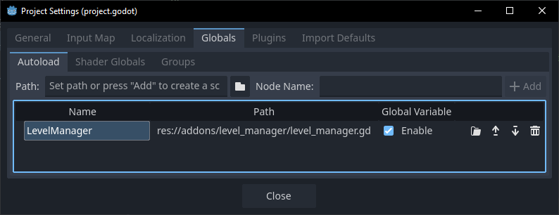

## Step 4 - Dynamic Inspector Fields

This last feature is probably the most important one.

Right now, our `next_level_left` and `next_level_right` fields look like this in the inspector:


They are simple string inputs.

Obviously this could lead to typos, which could break everything!

Also, it's just kind of annoying to have to manually type in the level names.

We *could* use `@export_enum` to provide a dropdown list of items,
but we'd essentially need to hardcode the list.

Fortunately, Godot has a feature which can remedy this: {{ comp.gddoc({ gd: "method Object._validate_property" }) }}.

::: aside
It would also be possible to create an [Inspector Plugin](https://docs.godotengine.org/en/stable/tutorials/plugins/editor/inspector_plugins.html) for this feature,
but that's a lot more work for the same result.
:::

First, we need to convert our `level.gd` script to a `@tool` script,
and then we need to override `_validate_property()` to populate the enum fields.

We should also call {{ comp.gddoc({ gd: "method Object.notify_property_list_changed" }) }} whenever the levels need to be updated,
so we'll just connect that directly to `levels_refreshed`.

```gdscript:/node_types/level.gd
@tool
extends Node2D

@export var next_level_left: String = ""
@export var next_level_right: String = ""

func _enter_tree() -> void:
	LevelManager.levels_refreshed.connect(notify_property_list_changed)

func _exit_tree() -> void:
	LevelManager.levels_refreshed.disconnect(notify_property_list_changed)

func _validate_property(property: Dictionary) -> void:
	if property.name in ["next_level_left", "next_level_right"]:
		property.hint = PROPERTY_HINT_ENUM
		property.hint_string = ",".join(LevelManager.levels.keys())
```

And, well, that's it!

We can verify that it's working by simply looking in the inspector:

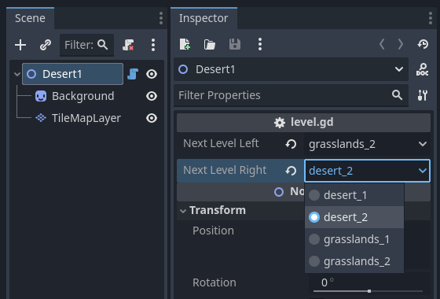

::: note
If you're currently in a level scene while updating `level.gd`,
you may need to use `Scene -> Reload Saved Scene` to see the new inspector property behavior.
:::

## It's finally over??

That seemed like a lot of work just to avoid typing out some strings!

Honestly, it was.

But, especially if you're working in a team, I think it's worth it.

Also, here are some other neat ideas to implement:

- Use the levels list in other entities, such as teleporters!
- Create a graph view or map showing how all the levels are connected together!
- Use the level ids for easier network synchronization!

Anyways, you can check out the final project here:

[{{ comp.icon({ icon: "github" }) }} apples/level_manager_demo](https://github.com/apples/level-manager-demo){.button}

Thanks for reading!
