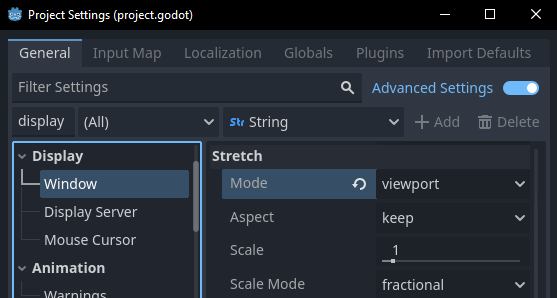
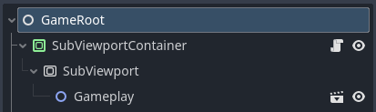
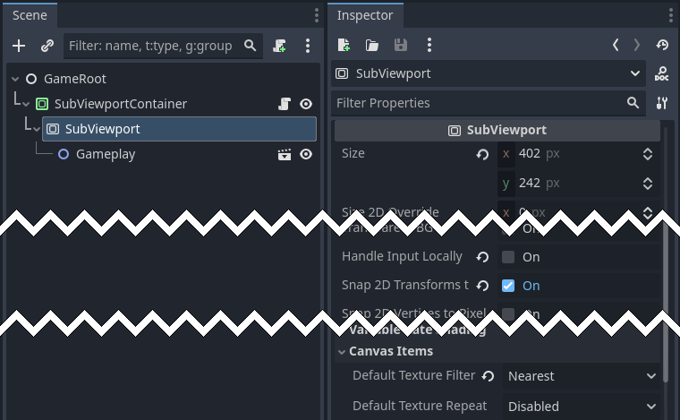
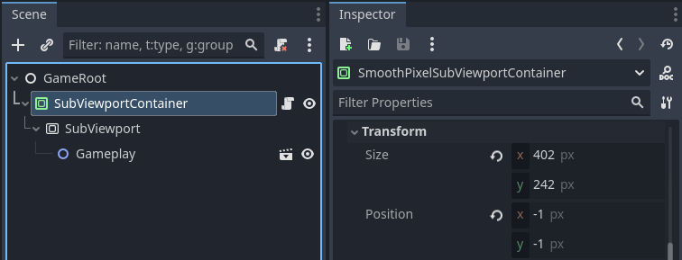
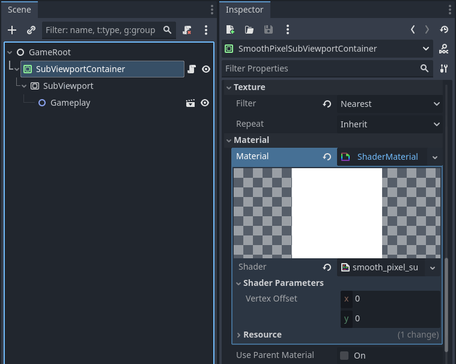

## Introduction

::: note
If you're just here to snag some code, I've made a plugin that implements this technique.

Find it here:

[{{ comp.icon({ icon: "github" }) }} apples/godot-smooth-pixel-subviewport-container](https://github.com/apples/godot-smooth-pixel-subviewport-container){.button}
:::

Making pixel-perfect games in Godot is extremely easy.

Simply go into your Project Settings and set `display/window/stretch/mode` to `viewport`.



This will ensure that the game's "natural" resolution never changes, and the game's viewport will be stretched to fill the window.

{{ comp.video({ src: "stretch_mode_viewport.webm" }) }}

This looks great! Depending on your game, this might be the ideal solution.

However, there are a few downsides to this approach:

1. Camera motion is snapped to the pixel grid.

		This is fine for games where the camera is either fixed or moves in lockstep with the player.
		But if you want your camera to be springy or damped, you'll immediately notice a jittering effect.
		Tricks to work around this involve careful movement of the camera, such as only allowing 8-directional movement.

2. Depending on the window size, pixels could be different sizes.

		This is caused by non-integer scaling.
		Forcing integer scaling would fix this issue, but requires a black border in the remaining space.

3. Text and UI elements are limited to the viewport resolution, and cannot be smoothed out.

		This is fine when your game is explicitly aiming for a very specific aesthetic,
		such as replicating the art style of a GBA game.
		But, this generally means you'll need to make all your own fonts.
		Supporting multiple writing systems becomes a big pain point,
		and it can be an accessibility issue for some people.

::: note
**I must stress:** These problems may not be *wrong* for your game!
If you're making a hardware-accurate GameBoy style game, for example,
then you should definitely just use the viewport scaling mode and not think about any of this!
:::

## Problem 1 - Jittery Camera Motion

The jittery camera motion is caused by the camera's position being limited to the pixel grid.

As the camera moves through space, it will be snapped to the nearest pixel.

This occurs regardless of canvas item snap settings, since it's simply the nature of how the renderer works.

Since the camera's motion might not be perfectly aligned with a cardinal direction,
the positions that it gets snapped to will feel a bit random, hence the jittering.

To fix this, we need to move *the viewport itself*, in addition to the camera.

::: note
This implementation is largely derived from <https://www.youtube.com/watch?v=zxVQsi9wnw8>.

Please check out Picster's video for some fantastic animations and demonstrations!

(Unfortunately it seems like his approach doesn't work well in Godot 4, so I changed some things.)
:::

Here's our goal: Create a SubViewport that is slightly larger than our game's resolution,
and use the viewport's fractional position to nudge the SubViewportContainer's position to create smooth camera motion.

A quick animation to demonstrate:

{{ comp.video({ src: "camera_motion_illustration_window.webm", loop: true }) }}

In this animation, the outer yellow rectangle is our SubViewport's rendered contents.
The inner pink rectangle is the actual window area shown to the player.
The SubViewport is slightly larger than the window to ensure that we don't run out of pixels to show when shifting the camera.

Here's the same animation, but from a global reference frame:

{{ comp.video({ src: "camera_motion_illustration.webm", loop: true }) }}

First, we need to change the project setting `display/window/stretch/mode` to `canvas_items`.


Then, at the top level of our scene tree, we need to implement our own sub-viewport.

This is trivial to set up with {{ comp.gddoc({ gd: "SubViewport" }) }} and {{ comp.gddoc({ gd: "SubViewportContainer" }) }}.



We must ensure that the `SubViewport` has the correct size.
The natural assumption would be that it should match our game's resolution.
But since we'll be moving the viewport itself (by up to half a pixel in any direction),
the subviewport size needs to be expanded by 1 pixel in each direction (an extra 2 pixels in total).


Additionally, we need to set {{ comp.gddoc({ gd: "property Viewport.canvas_item_default_texture_filter" }) }} to `TEXTURE_FILTER_NEAREST`.
This is because it doesn't inherit this value from the Project Settings.



For the SubViewportContainer, we first need to ensure that it covers the screen, and that its position is `(-1, -1)`.

This should make it overflow each edge of the screen by exactly 1 pixel.



We also need to create a custom {{ comp.gddoc({ gd: "ShaderMaterial" }) }} for the container,
assigned to its {{ comp.gddoc({ gd: "property CanvasItem.material" }) }} property.

Save the shader file somewhere sensible.



The shader code is extremely simple:

```gdshader:smooth_subviewportcontainer.gdshader
shader_type canvas_item;

uniform vec2 vertex_offset;

void vertex() {
	VERTEX += vertex_offset;
}
```

And we'll calculate `vertex_offset` in a script attached to our `SubViewportContainer`:

```gdscript:smooth_subviewportcontainer.gd
extends SubViewportContainer

func _ready() -> void:
	RenderingServer.frame_pre_draw.connect(_on_rendering_server_frame_pre_draw)

func _on_rendering_server_frame_pre_draw() -> void:
	var subviewport: SubViewport = $SubViewport
	
	var camera_position := subviewport.canvas_transform.origin
	var rounded_position := camera_position.round()
	var offset := camera_position - rounded_position
	
	subviewport.canvas_transform.origin = rounded_position
	
	material.set_shader_parameter("vertex_offset", offset)
```

All this script does is hook into the `RenderingServer.frame_pre_draw` signal,
which is called every frame just before rendering.

Inside the signal callback, we get the camera position from the subviewport's {{ comp.gddoc({ gd: "property Viewport.canvas_transform" }) }}.
Then, we split it into fractional and integer components.

The integer component (`rounded_position`) is used as the final `canvas_transform` position, to snap the rendering to the nearest pixel.

The fractional component (`offset`) is sent to the shader, and it's used to move the viewport itself a tiny amount.

The result is smooth sub-pixel camera motion!

{{ comp.video({ src: "smooth_camera_motion.webm" }) }}

Buttery.

## Problem 2 - Non-uniform Pixel Sizes

You may have noticed a sort of... shimmering effect, with the smooth camera motion.

Let's take a closer look at our pixels:


Our pixels are different sizes, and some are rectangular! Why?

This is caused by non-integer scaling.
Each pixel's size can change depending on where exactly it is in the viewport,
and when things are in motion this causes the shimmering.

::: note
This is not *caused* by the camera motion, it's just made more obvious by it.
Even if you don't plan on using the camera motion solution, you'll still have this problem with non-integer scaling.
:::

A super quick fix for this would be to use Godot's built-in integer scaling.
Simply set `display/window/stretch/scale_mode` to `integer`.


Depending on your game, this is probably good enough! And you may want to implement it as an in-game option for players who desire it.

But, this does result in the window having excessive black bars in some cases.
What if we want to fully utilize the available window space, while also avoiding the non-uniform pixel sizes?

The solution for this is easy to say, but hard to implement: anti-aliasing.

Fortunately, it's mostly a shader effect.

The only property we need to change is our `SubViewportContainer`'s {{ comp.gddoc({ gd: "property CanvasItem.texture_filter" }) }} to `TEXTURE_FILTER_LINEAR`.


And then, everything else is in the fragment shader:

```gdshader:smooth_subviewportcontainer.gd {data-start=9}
void fragment() {
	vec2 uv_per_pixel = fwidth(UV);
	
	vec2 nearest_texel_corner = round(UV / TEXTURE_PIXEL_SIZE);
	vec2 nearest_texel_corner_uv = nearest_texel_corner * TEXTURE_PIXEL_SIZE;
	
	vec2 uv_dist_to_nearest = UV - nearest_texel_corner_uv;
	vec2 pixel_dist_to_nearest = uv_dist_to_nearest / uv_per_pixel;
	
	vec2 bilinear_filter_value = clamp(pixel_dist_to_nearest, -0.5, 0.5);
	vec2 sharp_uv = (nearest_texel_corner + bilinear_filter_value) * TEXTURE_PIXEL_SIZE;
	
	COLOR = texture(TEXTURE, sharp_uv);
}
```

For posterity, here's a full breakdown of the math:

::: details Shader Math Explanation

Here are our goals:

- The interior of each subviewport pixel (texel) should be unaffected and remain a solid color.
- The edges of each texel should be anti-aliased, that is to say, a blend of the neighboring texels.

We can make the GPU do the heavy lifting of the edge blending by using a (bi)linear `sampler2D`.
(In our case, since this is a `canvas_item` shader, we'll be using the built-in `TEXTURE` sampler,
which means we need to ensure that our `SubViewportContainer`'s `texture_filter` property is set to Linear.)

Sampling the texture in the center of a texel will give us the unblended color of that texel by itself.
And sampling at the edge of a texel will give us an equal blend of all 4 adjacent texels.
Edges are at integer texel coordinates, and the centers are at (0.5, 0.5) offsets.

Line by line:

First, we use `fwidth(UV)` to get the texel size in UV space.
(Well, it's a little more complicated than that if the canvas item is rotated, but ours isn't.)

We can use this value to convert between UV coordinates and screen pixel coordinates.

```gdshader:smooth_subviewportcontainer.gd {data-start=10}
	vec2 uv_per_pixel = fwidth(UV);
```

Next, we get the nearest texel corner by rounding.
In Godot shaders, `TEXTURE_PIXEL_SIZE` can be used to convert between UV and texel coordinates.

```gdshader:smooth_subviewportcontainer.gd {data-start=12}
	vec2 nearest_texel_corner = round(UV / TEXTURE_PIXEL_SIZE);
	vec2 nearest_texel_corner_uv = nearest_texel_corner * TEXTURE_PIXEL_SIZE;
```

Now, we get the distance from our current fragment to that corner.

Importantly, we convert this distance to screen pixel coordinate space.
This means that for fragments on texel edges, the `pixel_dist_to_nearest` will be between -0.5 and 0.5,
and for all other fragments, it will exceed that range.

```gdshader:smooth_subviewportcontainer.gd {data-start=15}
	vec2 uv_dist_to_nearest = UV - nearest_texel_corner_uv;
	vec2 pixel_dist_to_nearest = uv_dist_to_nearest / uv_per_pixel;
```

Here's an illustration that might help think about this distance conversion:


If we clamp this distance to the range -0.5 to 0.5, we can directly use the result as our bilinear filter value.

```gdshader:smooth_subviewportcontainer.gd {data-start=18}
	vec2 bilinear_filter_value = clamp(pixel_dist_to_nearest, -0.5, 0.5);
```

To apply this value, we just need to add it to the corner's texel coordinate and convert it to UV space.

Remember that non-edge fragments exceeded the distance range -0.5 to 0.5, and were therefore clamped to those values.
And sampling a texture at (+/-0.5, +/-0.5) will give us the unblended color of that texel by itself.
Edge fragments fall within that range, and will therefore be blended appropriately.

```gdshader:smooth_subviewportcontainer.gd {data-start=19}
	vec2 sharp_uv = (nearest_texel_corner + bilinear_filter_value) * TEXTURE_PIXEL_SIZE;
	
	COLOR = texture(TEXTURE, sharp_uv);
```

If you want to learn how this type of shader works,
check out this amazing video by t3ssel8r:

<https://www.youtube.com/watch?v=d6tp43wZqps>

I'm using a different geometric approach, because I feel that it's easier to understand,
but the result is mathematically identical to t3ssel8r's shader.

(I remember seeing a really good Twitter thread about this topic, but I can't seem to find it :sob:)
:::

Anyways, check this out:


Fully anti-aliased, perfectly square pixels. As nature intended.

## Problem 3 - UI Layer

Alright, it's time to add some UI elements to the game.

As a first attempt, let's just add a {{ comp.gddoc({ gd: "CanvasLayer" }) }} with our UI in it to the gameplay scene.

{{ comp.video({ src: "terrible_ui.webm" }) }}

Wow, that looks horrible!
The UI is jittery and bad and makes me want to scream.

Obviously, this is because our UI is inside our SubViewport, which we are moving around with the camera offset.

To fix this, we need to move the UI layer outside of the SubViewportContainer used for gameplay,
and into its own SubViewport.

Create a new SubViewportContainer and SubViewport in the root scene, and move the UI into this SubViewport.


The `size` of the UI SubViewport should be exactly equal to the game resolution
(it should **not** have the extra 2 pixels, since we don't need the camera motion effect).

Additionally, it should have `transparent_bg` activated, so it will overlay on top of the gameplay.

As with the gameplay SubViewport, it should also have `snap_2d_transforms_to_pixel` enabled,
and `canvas_item_default_texture_filter` should be `nearest`.


The new SubViewportContainer will still need the pixel anti-aliasing effect,
so we need to set the material to use our custom shader (and set the `texture_filter` to Linear).


We don't need to add the script to this SubViewportContainer, since we're not using the camera motion effect.
The anti-aliasing effect doesn't need the script, it's all done in shader.

And with that, we should be done!

{{ comp.video({ src: "ui_complete.webm" }) }}

Perfect.

## Wrapping it up.

Well that was pretty straightforward, all things considered.

If you'd like to see a full demo and example project,
I've got one here:

[{{ comp.icon({ icon: "github" }) }} apples/godot-smooth-pixel-subviewport-container](https://github.com/apples/godot-smooth-pixel-subviewport-container){.button}

Oh, and also the addon in that project is availabe on the AssetLib here:

[{{ comp.icon({ icon: "godot" }) }} SmoothPixelSubViewportContainer - Godot Asset Library](https://godotengine.org/asset-library/asset/3346){.button}

Thanks for reading!
